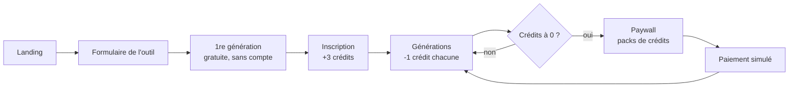
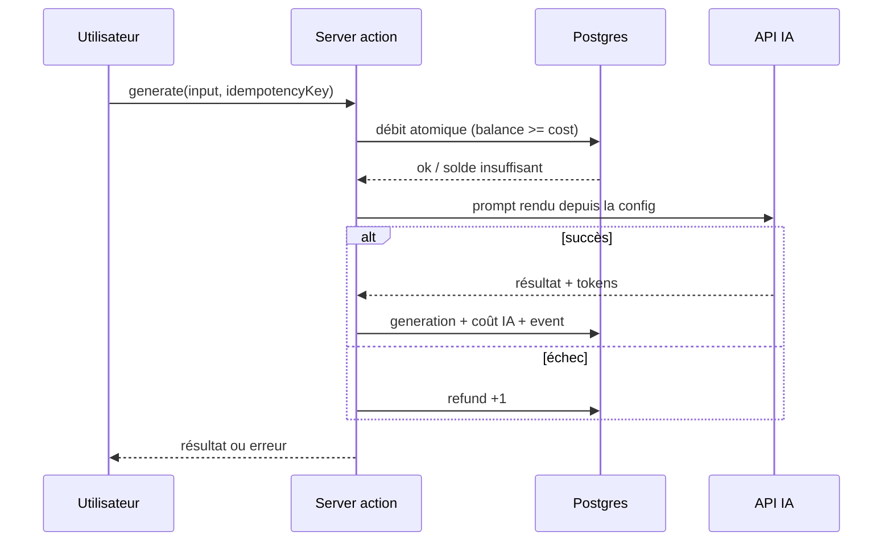

# Produit

Sep 23, 2026 · @Alex

## Pitch

Un backoffice Next.js qui permet à un SaaS studio de **lancer un nouveau micro-SaaS en quelques minutes via un formulaire**, puis de **piloter chaque produit par la donnée** jusqu'à la décision : on scale ou on coupe.

Chaque produit est un **outil IA avec crédits**, servi par une sub-app dynamique sur `/{slug}`. La sub-app charge sa configuration et devient immédiatement utilisable : landing, outil, compte, crédits, paiement.

**Pourquoi pour Dotworld** : c'est leur modèle en miniature. Plusieurs SaaS en parallèle sur un socle commun, la méthode Test → Learn → Scale, des produits B2C tirés par l'acquisition, un système de crédits, et la stack de leurs offres (Next.js, TypeScript, Tailwind, shadcn, server actions).

**Le moment clé de la démo** : je crée « Générateur de bio Instagram » dans le formulaire, j'ouvre `/bio-instagram`, je génère, je tombe sur le paywall, j'achète un pack (paiement simulé), et les chiffres apparaissent dans le dashboard. Deux minutes pour montrer tout le modèle.

## Le concept : un outil IA avec crédits

Un micro-SaaS qui fait **une seule chose** : l'utilisateur remplit un petit formulaire, l'IA génère un résultat, et chaque génération coûte des crédits. Exemples : générateur de lettre de motivation, de bio Instagram, de description produit, de post LinkedIn, de noms de marque.

Ce format colle au modèle d'un studio :

- **Le build est quasi identique d'un produit à l'autre.** Seuls changent le prompt, les champs du formulaire, le branding et la landing, donc tout peut venir d'une config.
- **L'acquisition passe par le SEO.** Une landing par produit, qui vise un mot-clé (« générateur de lettre de motivation »).
- **La monétisation est simple et mesurable.** Des crédits gratuits pour tester, puis des packs payants, avec une marge calculable par génération.

## Parcours utilisateur (sub-app `/{slug}`)

La première génération est gratuite et sans compte, pour créer le « aha moment » avant de demander quoi que ce soit.



1. **Landing** : titre, promesse, exemple de résultat, FAQ. Tout vient de la config, y compris les métadonnées SEO.
2. **Formulaire de l'outil**, généré depuis la liste de champs de la config. Pour une lettre de motivation : poste visé, entreprise, expérience, ton.
3. **Première génération gratuite**, limitée par cookie et IP.
4. **Inscription** : crédits offerts (par exemple 3).
5. **Générations** jusqu'à épuisement, puis **paywall** avec des packs (10 crédits à 4,90 €, 50 crédits à 14,90 €).
6. **Historique** des générations : copier, télécharger, regénérer.

## Configuration d'un produit

**Un seul schéma Zod décrit un produit.** Il valide le formulaire du backoffice, type la base de données et pilote le rendu de la sub-app. Ajouter un produit = remplir un formulaire, sans déploiement.

```ts
{
  slug: "lettre-motivation",
  name: "LettrePro",
  status: "test",              // test | learn | scale | killed
  themeId: "editorial",        // thème choisi parmi ceux en base
  branding: { logoUrl, primaryColor? },  // surcharges optionnelles du thème
  landing: { headline, subheadline, faq[], seoTitle, seoDescription },
  inputs: [                    // champs du formulaire utilisateur
    { key: "poste", label: "Poste visé", type: "text", required: true },
    { key: "ton", label: "Ton", type: "select", options: ["formel", "dynamique"] }
  ],
  generation: {
    model: "claude-…",
    promptTemplate: "Rédige une lettre de motivation pour {{poste}}… ton {{ton}}",
    outputType: "markdown"     // markdown | image
  },
  pricing: {
    freeCreditsOnSignup: 3,
    anonymousFreeGenerations: 1,
    costPerGeneration: 1,
    packs: [{ credits: 10, priceCents: 490 }, { credits: 50, priceCents: 1490 }]
  }
}
```

| Bloc du formulaire | Ce qu'on saisit | Contrôle |
| --- | --- | --- |
| Identité | Nom, slug, statut | Slug unique, format URL |
| Thème | Choix d'un thème en base, logo, couleur principale optionnelle | Thème existant, contraste lisible si surcharge |
| Landing & SEO | Titres, FAQ, meta | Longueurs SEO |
| Champs de l'outil | Liste de champs (texte, zone de texte, select) | Clés uniques |
| Génération | Modèle, template de prompt, type de sortie | Chaque `{{variable}}` correspond à un champ |
| Pricing | Crédits offerts, coût par génération, packs | Valeurs positives |

Le bloc **Champs de l'outil** est un mini form-builder : la sub-app génère son propre formulaire à partir de cette liste. Un bouton **« Tester le prompt »** lance une génération depuis le backoffice avant publication.

### Thèmes

Un produit ne définit pas son design : il **choisit un thème parmi ceux déjà configurés en base**, puis surcharge au besoin le logo et la couleur principale. Lancer un produit reste une affaire de minutes, et tout le portefeuille garde une qualité visuelle homogène.

**Ce que contient un thème** (table `themes`, validé par un schéma Zod) :

- **Tokens de couleur** en clair et en sombre : `background`, `foreground`, `primary`, `accent`, `muted`, `border`… Ce sont exactement les variables CSS de shadcn/ui.
- **Typographie** : police des titres, police du texte, échelle.
- **Forme** : `radius`, ombres, densité.
- **Variante de landing** : la mise en page de la page d'accueil (par exemple hero centré, hero avec exemple à droite, format minimal).

**Thèmes seedés pour la démo**

| Thème | Style | Pour quel produit |
| --- | --- | --- |
| Editorial | Serif, tons papier, sobre | Lettre de motivation, CV |
| Neon | Sombre, accents vifs, arrondis | Bio Instagram, contenus réseaux sociaux |
| Corporate | Sans-serif, bleu, dense | Descriptions produit, B2B léger |
| Playful | Couleurs pastel, très arrondi | Noms de marque, outils créatifs |

**Dans le formulaire**, le choix se fait sur des **vignettes visuelles** de chaque thème, avec un aperçu de la landing qui se met à jour en direct.

**Au runtime**, la sub-app injecte les tokens du thème en variables CSS sur son layout. Tous les composants shadcn suivent sans aucune modification de code. Modifier un thème en base met à jour d'un coup **tous les produits qui l'utilisent** : c'est la mutualisation du studio rendue visible.

## Mécanique des crédits

C'est la partie qu'un recruteur regardera. L'objectif : **aucun crédit perdu, aucun crédit gratuit par erreur, aucun solde négatif**, même en cas de double clic, de retry réseau ou d'échec de l'IA.

- **Un ledger, pas un compteur.** Une table `credit_transactions` enregistre chaque mouvement : `+3 signup_bonus`, `+10 purchase`, `-1 generation`, `+1 refund`. Le solde est la somme des lignes, avec un solde dénormalisé mis à jour dans la même transaction.
- **Pas de solde négatif.** Le débit est un `UPDATE … SET balance = balance - cost WHERE balance >= cost` atomique. Deux onglets avec 1 crédit : un seul passe.
- **Débit avant l'appel IA, remboursement si l'appel échoue.** Personne ne paie une erreur, personne n'obtient un résultat gratuit.
- **Idempotence.** Chaque génération porte une clé unique : un retry ne débite pas deux fois.
- **Paiement.** L'achat et ses crédits sont écrits dans la même transaction ; en v1, le paiement est simulé (détail ci-dessous).
- **Anonyme.** La génération gratuite est limitée par cookie et IP, contre l'abus.



Le diagramme montre le chemin d'une génération : le débit précède l'appel IA, et un échec déclenche un remboursement écrit dans le ledger.

### Paiement : une seule fonction `purchase`

La v1 n'a pas Stripe : le sujet de la démo, c'est la logique de crédits, pas l'encaissement. Le clic sur un pack ouvre une **modale de paiement simulée** (plein écran sur mobile) : récapitulatif du pack, prix, carte de test préremplie, bouton « Payer (simulé) ». Ce bouton appelle une server action `purchase(packId)` qui, **dans une seule transaction**, enregistre l'achat dans `purchases` et ajoute `+N purchase` au ledger. La modale affiche la confirmation et le nouveau solde, puis se ferme : l'utilisateur reste sur l'outil, sans rupture dans le parcours.

Une clé d'idempotence générée côté client protège du double clic, comme pour les générations.

Passer au vrai Stripe plus tard : la modale est remplacée par Stripe Checkout, et le webhook Stripe appelle la même logique d'achat. Le modèle de données et le ledger ne changent pas.

## Backoffice : piloter chaque produit

Le backoffice répond à la question qu'un studio se pose chaque semaine : **ce produit, on le pousse ou on le coupe ?**

**Écrans**

- **Portefeuille** : tous les produits, avec statut, visites, revenu et marge sur 30 jours, triables.
- **Fiche produit** : funnel, métriques, courbes sur 30 jours, dernières générations.
- **Création / édition** : le formulaire de config, avec aperçu et test du prompt.

**Le funnel suivi par produit**

visites landing → 1re génération → inscription → crédits épuisés → achat

| Métrique | Calcul | Pourquoi |
| --- | --- | --- |
| Conversion par étape | Ratio entre deux étapes du funnel | Voir où ça fuit |
| Revenu | Somme des achats | Le résultat |
| ARPU | Revenu / utilisateurs inscrits | Valeur d'un utilisateur |
| Coût IA | Tokens × prix du modèle, stocké par génération | Souvent oublié |
| Marge par génération | Prix d'un crédit − coût IA | Central pour une boîte autofinancée |

**Statut Test → Learn → Scale → Killed**

Chaque produit porte un statut, et sa fiche affiche les seuils de décision. Deux règles, évaluées après 1 000 visites :

- **à couper** si la conversion inscription → achat est inférieure à 2 % ;
- **à scaler** si elle atteint au moins 5 % et que la marge par génération est positive.

Entre les deux, pas de badge : on continue d'observer. Les seuils sont **paramétrables depuis le backoffice** (BO-09) : un réglage par défaut pour le studio, surchargeable produit par produit (table `decision_thresholds`). Le backoffice suggère le passage de statut, l'humain décide.

Toutes ces métriques sortent d'**une seule table `events`** (`product_id`, `type`, `user_id`, `anonymous_id`, `metadata`, `created_at`), agrégée en SQL, sans outil d'analytics externe.

## Mode démo public

L'URL va circuler, et le backoffice sera ouvert à des inconnus. **Le prochain recruteur doit toujours trouver la démo dans l'état du script.**

- **Compte admin de démo** créé par le seed. Les identifiants sont **envoyés avec la candidature**, pas affichés dans l'app. Pas d'inscription admin possible.
- **Pas de verrou sur les données seedées** (décision du run v1) : je réinitialise la démo avant chaque présentation, un verrou n'apporterait rien. Produits, thèmes et seuils seedés se modifient comme les autres ; la colonne `is_seed` sert seulement au seed et à la remise à zéro pour savoir quoi garder.
- **Remise à zéro** : `scripts/reset-demo.ts` supprime les produits créés par les visiteurs et tout l'usage (générations, achats, crédits, events, comptes utilisateurs), restaure le catalogue seedé, puis rejoue l'usage du seed. Il est déclenché par le bouton « Réinitialiser » d'une **page cachée** (`/admin/ops`), non listée dans la navigation, réservée à mon propre compte (rôle `owner`, distinct du compte admin de démo) : tout autre visiteur, anonyme ou admin, reçoit une 404. En bonus, un cron Vercel le lance aussi chaque nuit.
- **Limites** : pas de plafond sur le nombre de produits créés par les visiteurs (décision du run v1) ; le rate limit porte sur les générations.
- **Signal visuel** : un bandeau discret « Démo » sur les sub-apps rappelle que le paiement et l'email sont simulés, pour qu'aucun visiteur ne s'y trompe.
- **Identifiants** : avec `DEMO_MODE=true`, le seed refuse de tourner avec les identifiants de développement ; les comptes admin et `owner` viennent de `SEED_ADMIN_*` et `SEED_OWNER_*` (documentées dans `.env.example`).

`DEMO_MODE=true` ne fait donc que deux choses : afficher le bandeau et exiger de vrais identifiants au seed. En local et dans les tests, le mode démo est désactivé (`DEMO_MODE=false`).

## Contenu des produits seedés

La crédibilité de la démo repose sur des produits qui ressemblent à de vrais produits. C'est du travail de rédaction, planifié dans l'onglet Candidature (lot 8).

| Produit | Thème | Statut | À rédiger |
| --- | --- | --- | --- |
| LettrePro (lettre de motivation) | Editorial | Scale | Prompt système, 4 champs, landing, FAQ, 3 exemples |
| DescriPro (description produit) | Corporate | Learn | Idem |
| NomDeMarque (noms de marque) | Playful | Test, « à couper » | Idem, liste de noms en markdown (le schéma figé n'a pas de sortie structurée) |
| BioInsta (bio Instagram) | Neon | Créé en direct pendant la démo | Config prête à coller dans le formulaire, pour ne pas taper en live |

Les chiffres de chaque produit (visites, conversion, revenu, coût IA) sont choisis pour raconter une histoire sur 30 jours : LettrePro « à scaler », DescriPro sans badge, NomDeMarque « à couper », chacun avec au moins 1 000 visites. La config de BioInsta est prête à coller (`fixtures/bio-instagram.config.json`). En mode mock, l'IA sert à chaque produit sa propre fixture.

**Langues** : chaque produit a une **langue dans sa config** (`locale`), comme un vrai SaaS studio qui lance un produit par marché. Le contenu du produit (landing, FAQ, prompt) est déjà rédigé dans cette langue ; seuls les textes communs de la sub-app (boutons, paywall, modales, erreurs, environ 60 clés) passent par **next-intl**, en français et en anglais. Pas de segment `/fr` ou `/en` dans l'URL : la langue se déduit du produit via le root param `[app]`. Le backoffice reste en français. Moment de démo possible : créer BioInsta en anglais et montrer la sub-app entièrement en anglais. Détail dans l'onglet Stack.

## Architecture technique

Une seule app **Next.js 16.3.6**, sans API séparée : c'est la forme décrite dans les offres de Dotworld (Server Actions, Route Handlers, logique métier côté serveur). Le détail de chaque choix de framework, avec les sources, est dans l'onglet Next.js.

**Stack**

| Couche | Choix |
| --- | --- |
| Framework | Next.js 16.3.6 (App Router, Turbopack), React 19.2, TypeScript strict ; `cacheComponents`, `partialPrefetching`, `reactCompiler`, `typedRoutes` |
| UI | Tailwind v4, shadcn/ui |
| Formulaires | Server Actions + `useActionState`, `useOptimistic` pour le solde |
| Validation | Zod, un schéma partagé backoffice / DAL / runtime |
| Données | Postgres + Drizzle, derrière un Data Access Layer `server-only` |
| Auth | Better Auth (lien magique pour les utilisateurs, mot de passe pour l'admin), avec un rôle admin pour le backoffice |
| IA | AI SDK 7 (Vercel) via l'AI Gateway, modèles Anthropic par défaut, streamé par un Route Handler |
| Paiement | Simulé : server action `purchase()` dans une modale |
| Graphiques | Recharts (via les charts shadcn) |
| Tests | Vitest (DAL), Playwright + `instant()` de `@next/playwright` (parcours) |
| Outillage agents | `AGENTS.md` géré par `next dev`, `next-devtools-mcp`, skill `next-dev-loop` |
| Déploiement | Vercel, ou Docker sur Fly.io ; Postgres managé ; URL publique |

**Routing**

```
app/
  (backoffice)/                   // root layout admin
    admin/
      page.tsx                    // portefeuille
      products/new/page.tsx       // formulaire produit
      products/[slug]/page.tsx    // fiche produit + métriques
      products/[slug]/activity/page.tsx
      themes/page.tsx, themes/[id]/page.tsx
      products/_actions.ts        // saveProduct, testPrompt ; une action par domaine
  (products)/
    [app]/                        // root layout produit : thème, header, slot @modal
      page.tsx                    // landing
      tool/page.tsx, history/page.tsx, pricing/page.tsx
      checkout/[packId]/page.tsx  // paiement, page complète (accès direct)
      signup/page.tsx
      @modal/(.)checkout/[packId]/page.tsx   // paiement en modale
      @modal/(.)signup/page.tsx              // inscription en modale
      api/generate/route.ts       // génération IA streamée
      checkout/_actions.ts        // purchase ; signup/_actions.ts pour l'inscription
      opengraph-image.tsx, icon.tsx, not-found.tsx
  sitemap.ts, robots.ts
lib/
  dal/                            // server-only : credits.ts, products.ts, themes.ts, session.ts
  schemas/                        // schémas Zod partagés
  fonts.ts                        // catalogue de polices des thèmes
```

`[app]` est placé au-dessus du root layout des sub-apps : c'est un **root param**, lisible depuis n'importe quel Server Component avec `next/root-params`. Le layout charge la config, renvoie `notFound()` si le produit est inconnu ou `killed`, et applique le thème en variables CSS. Les modales d'inscription et de paiement sont des **intercepting routes** : elles s'ouvrent par-dessus l'outil avec leur propre URL, et la même URL affiche la page complète en accès direct. En bonus, `proxy.ts` réécrit `{slug}.domaine.com` vers `/{slug}`.

**Modèle de données**

10 tables métier : le catalogue (`users`, `themes`, `products`, `product_versions`, decision\_thresholds) et l'usage (`credit_transactions`, `balances`, `generations`, `purchases`, `events`). Colonnes, contraintes, invariants, index et extrait Drizzle du ledger : onglet Modèle de données.

Les crédits sont **par produit** : chaque SaaS est indépendant pour l'utilisateur, comme dans un vrai portefeuille.

**Cache** : la config d'un produit, les thèmes et la liste des produits sont mis en cache avec `'use cache'` et tagués (`product:{slug}`, `theme:{id}`, `products`). Chaque sauvegarde du backoffice appelle `updateTag` : le produit, sa landing, son SEO et tous les produits d'un thème modifié sont à jour à la requête suivante, sans redéploiement. Le solde et l'historique, propres à l'utilisateur, ne sont jamais mis en cache : ils arrivent en streaming sous `<Suspense>`.

## Scope et script de démo

Peu de choses, finies et solides : **un seul type de produit, 2 ou 3 produits seedés, un flux de création en direct.**

**Indispensable**

- [ ] Backoffice : portefeuille, fiche produit avec métriques, formulaire de création et d'édition
- [ ] Sub-app dynamique : landing, formulaire, génération, historique
- [ ] Crédits : ledger, débit atomique, remboursement, paywall
- [ ] Achat simulé : purchase() enregistre l'achat et crédite le ledger en une transaction
- [ ] Seed : 2 ou 3 produits (lettre de motivation, description produit e-commerce, noms de marque) avec 30 jours d'events simulés, dont un produit à couper et un à scaler
- [ ] Déploiement avec une URL publique et un compte admin de démo

**Bonus si le temps le permet**

- Streaming de la réponse IA
- Sortie image
- Sous-domaine par produit
- Aperçu en direct de la landing pendant la saisie de la config

**Script de démo (2 minutes)**

1. Le portefeuille : trois produits, l'un en Scale, l'un signalé « à couper ». On lit la décision dans les chiffres.
2. Création en direct de « Générateur de bio Instagram » : choix du thème (aperçu en direct), champs, prompt, pricing. Test du prompt, puis publication.
3. Ouverture de `/bio-instagram` : la landing est déjà brandée et référencée.
4. Première génération sans compte, inscription, générations jusqu'au paywall.
5. Achat d'un pack dans la modale de paiement simulée : le solde est crédité immédiatement et l'utilisateur reprend sa génération.
6. Retour au backoffice : le funnel, le revenu et le coût IA du nouveau produit sont déjà là.

## Méthode de delivery agentique

Dotworld le dit : **« We develop with AI, not alongside it »**, et Claude Code est leur outil préféré. Le repo montre donc la méthode autant que le produit : vitesse des agents, qualité garantie par des garde-fous humains.

**Ce que le repo montre**

- `specs/` : une spec par fonctionnalité (SDD), écrite avant le code. Elle couvre le comportement attendu, les cas limites et les critères d'acceptation.
- `CLAUDE.md` : les conventions du projet, les commandes et les règles (pas de logique métier dans les composants, tout débit passe par le ledger…).
- **TDD sur le cœur métier** : les tests du ledger (concurrence, idempotence, remboursement) et de purchase() sont écrits avant l'implémentation.
- **Un test end-to-end Playwright** qui rejoue le script de démo complet.
- **Un historique de PR lisible**, une PR par spec, chacune relue par un humain.
- **Un README** qui raconte le process : combien de temps, quelle part du code produite par agents, où l'humain a tranché.

**Le découpage en specs** : 28 specs minimales réparties en 5 vagues, dans l'onglet Specs. La méthode pour les faire avancer en parallèle est décrite dans l'onglet Implémentation.

**Ce que ça démontre** : le même mode opératoire que chez Trusk (SDD + TDD, 100 % du code produit par agents, 100 % relu par un humain), appliqué au métier de Dotworld.
