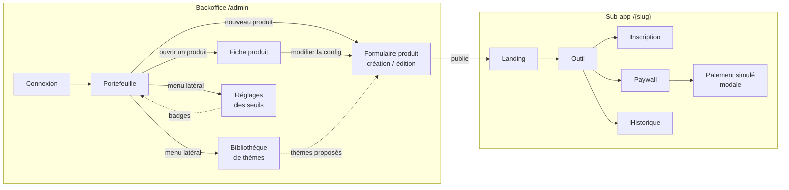

# Écrans à concevoir

## Carte des écrans

La démo compte **17 écrans** : 9 côté backoffice (admin du studio) et 8 côté sub-app (utilisateur final). **12 sont indispensables** au script de démo, les autres sont des bonus. Les écrans de la sub-app sont conçus une seule fois et héritent du thème de chaque produit.

Les numéros (BO-x, SA-x) servent de référence dans les maquettes et les specs.

## Backoffice

Un design unique, sobre et dense (shadcn par défaut), indépendant des thèmes produits.

| # | Écran | Route | Contenu clé | États à prévoir | Priorité |
| --- | --- | --- | --- | --- | --- |
| BO-01 | Connexion admin | /admin/login | Email + mot de passe, accès démo prérempli | Erreur d'identifiants | Indispensable |
| BO-02 | Portefeuille | /admin | Tableau des produits : statut, visites, conversion, revenu, coût IA, marge (30 j) ; KPIs globaux en tête ; badge « à couper » / « à scaler » | Vide (aucun produit), chargement | Indispensable |
| BO-03 | Fiche produit : vue d'ensemble | /admin/products/\[slug\] | Funnel en 5 étapes, KPIs, courbes 30 j, statut et seuils de décision, lien vers la sub-app | Produit sans données, produit killed | Indispensable |
| BO-04 | Fiche produit : activité | /admin/products/\[slug\]/activity | Dernières générations (entrée, sortie, coût), achats, mouvements de crédits | Vide, pagination | Bonus |
| BO-05 | Création / édition produit | /admin/products/new, …/\[slug\]/edit | Formulaire en étapes (détail ci-dessous) avec aperçu en direct de la landing | Erreurs de validation par étape, brouillon, publication | Indispensable |
| BO-06 | Changement de statut | Modale sur BO-03 | Statut actuel → nouveau, métriques qui justifient, note de décision | Confirmation, passage en killed | Bonus |
| BO-07 | Bibliothèque de thèmes | /admin/themes | Grille de vignettes, nombre de produits par thème | — | Bonus |
| BO-08 | Éditeur de thème | /admin/themes/\[id\] | Tokens (couleurs clair/sombre, typo, radius), variante de landing, aperçu | Avertissement : « utilisé par N produits » | Bonus |
| BO-09 | Réglages des seuils | /admin/settings | Seuils par défaut du studio (visites minimales, conversion « à couper », conversion « à scaler », marge positive exigée) ; surcharges par produit ; aperçu des badges qui changent | Erreur si « à couper » ≥ « à scaler » | Indispensable |

**BO-05 en détail : les étapes du formulaire**

1. **Identité** : nom, slug (généré depuis le nom, modifiable), statut initial.
2. **Thème** : vignettes des thèmes en base, logo, couleur principale optionnelle.
3. **Landing & SEO** : titre, sous-titre, FAQ (liste éditable), meta title et description avec compteur de caractères.
4. **Champs de l'outil** : liste de champs, réordonnés par des boutons monter / descendre (clé, libellé, type, requis, options).
5. **Génération** : modèle, template de prompt avec les `{{variables}}` disponibles cliquables, type de sortie, bouton « Tester le prompt » avec résultat, tokens et coût.
6. **Pricing** : crédits offerts, générations anonymes, coût par génération, packs ; marge estimée par génération.
7. **Récapitulatif** : résumé, aperçu final, bouton « Publier », puis lien vers `/{slug}`.

## Sub-app `/{slug}`

Chaque écran est conçu **une fois**, puis vérifié avec les 4 thèmes en clair et en sombre. Mobile d'abord : le trafic B2C venu du SEO et des réseaux sociaux arrive surtout sur téléphone.

| # | Écran | Route | Contenu clé | États à prévoir | Priorité |
| --- | --- | --- | --- | --- | --- |
| SA-01 | Landing | /\[slug\] | Hero (titre, promesse, CTA), exemple de résultat, étapes « comment ça marche », tarifs, FAQ ; 3 variantes de mise en page selon le thème | — | Indispensable |
| SA-02 | Outil | /\[slug\]/tool | Formulaire généré depuis la config, bouton Générer avec coût en crédits, zone de résultat (copier, télécharger, regénérer), solde dans le header | Vide, génération en cours, résultat, erreur IA avec « crédit remboursé », solde insuffisant | Indispensable |
| SA-03 | Inscription / connexion | Modale sur SA-02 | S'affiche après la génération gratuite : « Créez un compte pour obtenir 3 crédits », email (lien magique) | Boîte de réception simulée en modale (email aux couleurs du produit, bouton « Me connecter »), lien expiré | Indispensable |
| SA-04 | Paywall / tarifs | /\[slug\]/pricing (et modale sur SA-02) | Packs de crédits, prix par génération, pack mis en avant, bouton Acheter qui ouvre la modale de paiement (SA-05) | — | Indispensable |
| SA-05 | Paiement simulé | Modale sur SA-04 et SA-02, plein écran sur mobile | Récapitulatif du pack, prix, carte de test préremplie, mention « paiement simulé », bouton Payer ; puis confirmation avec nouveau solde et CTA « Reprendre » | Formulaire, paiement en cours, confirmé | Indispensable |
| SA-06 | Historique | /\[slug\]/history | Liste des générations (date, entrées résumées, résultat), rouvrir, copier | Vide, pagination | Indispensable |
| SA-07 | Compte & crédits | /\[slug\]/account | Solde, historique des mouvements de crédits (ledger), achats, déconnexion | — | Bonus |
| SA-08 | Produit introuvable | /\[slug\] inconnu ou killed | Message sobre, lien vers les autres produits du studio | 404, produit fermé | Indispensable |

## Éléments transverses

Ces composants reviennent sur plusieurs écrans : ils se conçoivent une fois, avant les écrans.

**Sub-app (thémée)**

- **Header produit** : logo, nom, badge de solde de crédits (qui s'anime au débit et au crédit), menu compte.
- **Footer produit** : mentions, lien vers le studio.
- **Carte de résultat** : rendu markdown ou image, actions copier, télécharger, regénérer.
- **Carte de pack** : crédits, prix, prix unitaire, variante « recommandé ».
- **Champ dynamique** : un rendu par type (texte, zone de texte, select), avec erreurs.

**Backoffice**

- **Carte KPI** : valeur, variation sur 30 jours, sparkline.
- **Funnel** : 5 étapes avec volumes et taux de passage.
- **Badge de statut** : Test, Learn, Scale, Killed, avec une couleur par statut.
- **Vignette de thème** : mini-landing rendue avec les tokens du thème, sélectionnable.
- **Aperçu en direct** : cadre qui rend la landing de la config en cours d'édition.

**États communs**

- Squelettes de chargement, états vides avec action, toasts de succès et d'erreur.
- Responsive : backoffice pensé pour desktop (lisible sur tablette), sub-app mobile d'abord.
- Clair et sombre : obligatoire pour la sub-app (chaque thème définit les deux), optionnel pour le backoffice.
