# Maquettes

Une maquette fil de fer par écran de l'onglet Écrans, avec les mêmes numéros. Elles fixent la structure et le contenu, pas le style final.

## Backoffice

Format desktop, design shadcn neutre. Les données sont celles du seed : 4 produits, dont NomDeMarque en Test et signalé « à couper ».

### BO-01 · Connexion admin

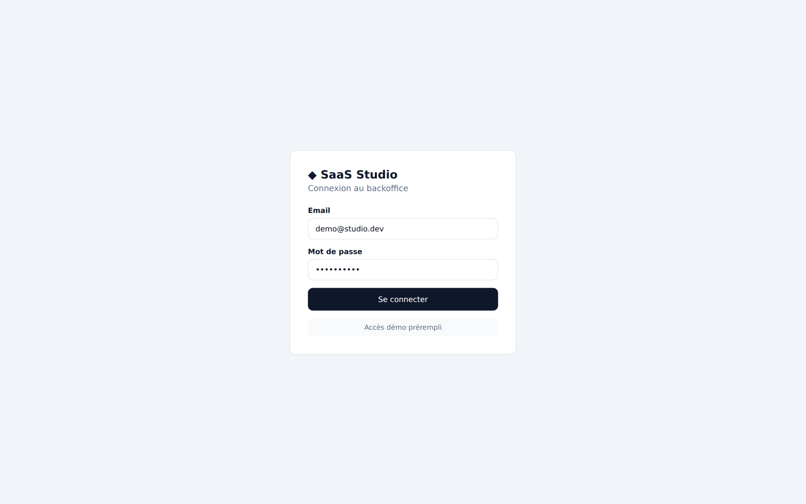

### BO-02 · Portefeuille

KPIs du studio en tête, puis un tableau où la décision se lit d'un coup d'œil : statut, conversion, marge, badge « à couper ».

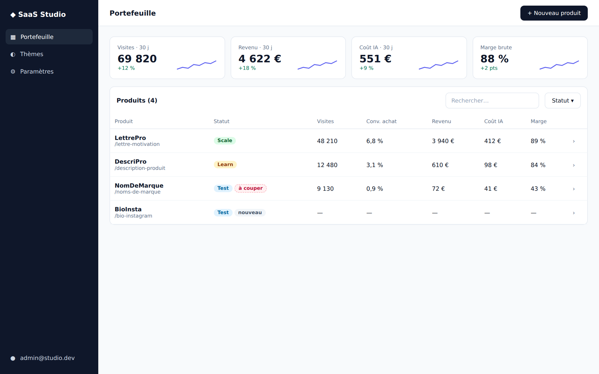

### BO-03 · Fiche produit, vue d'ensemble

Le funnel montre où ça fuit ; l'encart rouge apparaît quand un seuil de décision est franchi.

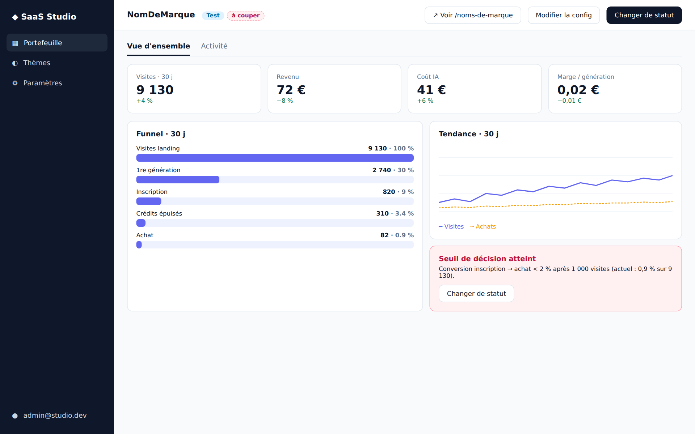

### BO-04 · Fiche produit, activité

Chaque génération avec son coût IA, et le ledger de crédits, remboursements compris.

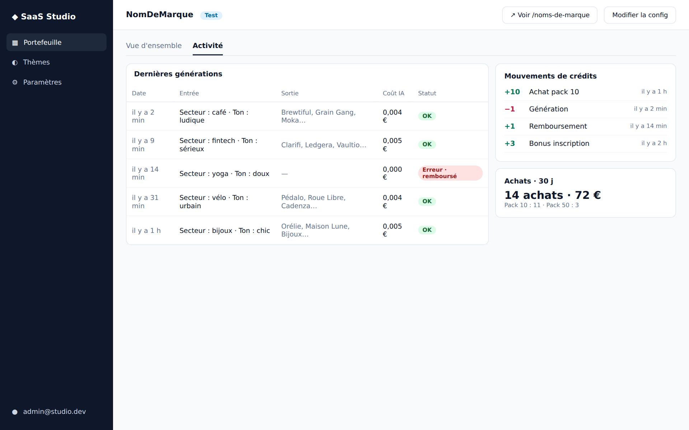

### BO-05 · Formulaire produit (étape Thème)

Les 7 étapes à gauche, le thème choisi sur vignettes, l'aperçu de la landing à droite qui suit chaque saisie.

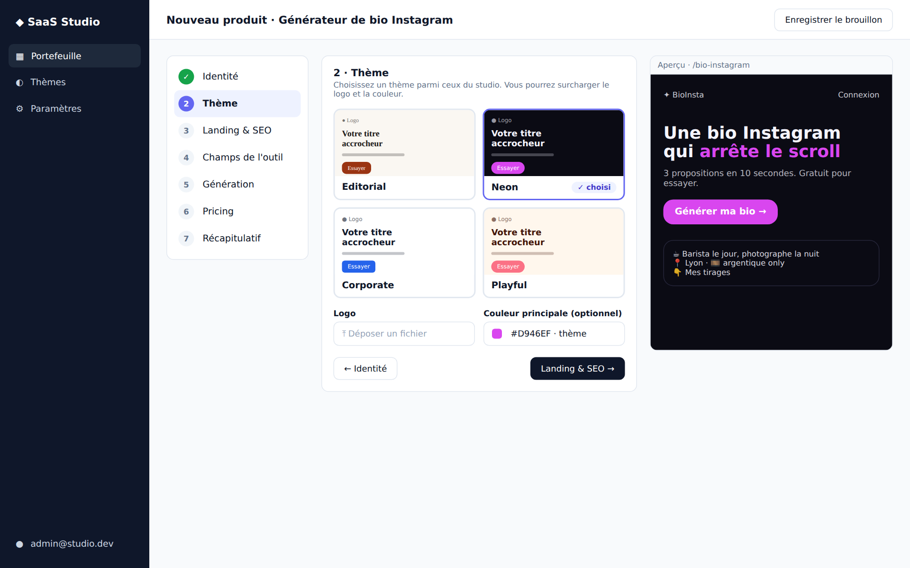

### BO-06 · Changement de statut

La modale rappelle les chiffres qui justifient la décision et garde une note.

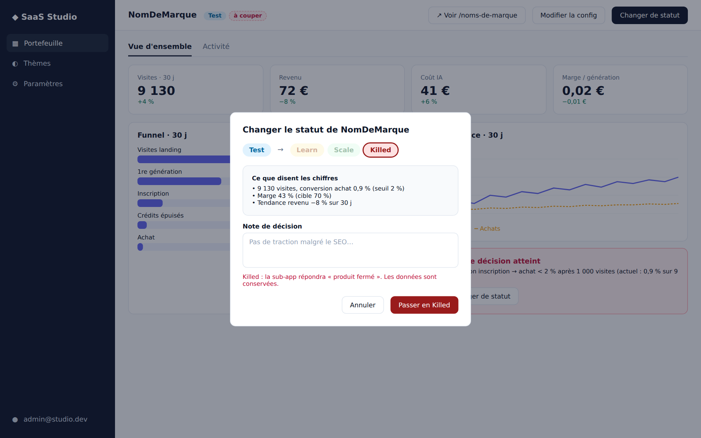

### BO-07 · Bibliothèque de thèmes

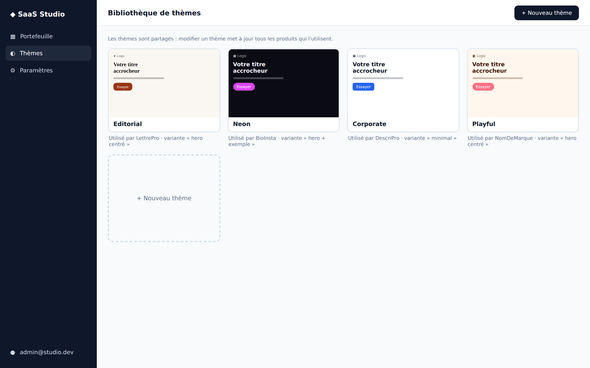

### BO-08 · Éditeur de thème

Tokens à gauche, rendu de la landing et des composants à droite, avertissement sur les produits impactés.

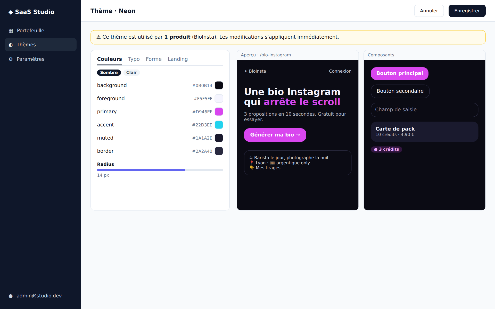

## Sub-app

Format mobile. Les écrans sont les mêmes pour tous les produits ; seuls le thème et la config changent. Le parcours d'achat (SA-02 à SA-05) suit BioInsta en thème Neon, comme dans le script de démo ; les autres écrans montrent les thèmes Editorial, Corporate et Playful.

### SA-01 · Landing (LettrePro, thème Editorial)

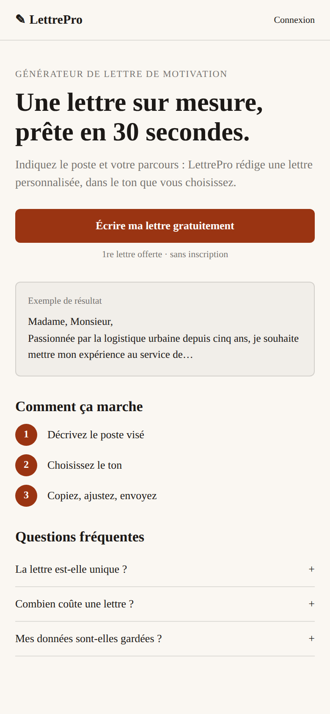

### SA-02 · Outil (BioInsta, thème Neon)

Formulaire généré depuis la config, coût affiché sur le bouton, solde dans le header. En bas, l'état d'erreur avec remboursement.

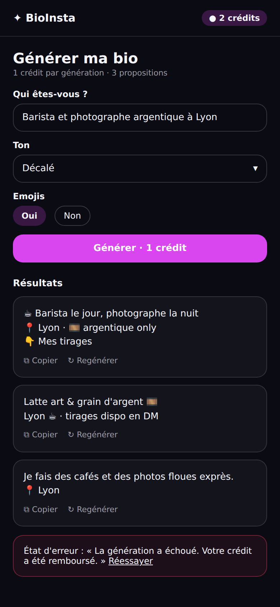

### SA-03 · Inscription

Feuille qui monte après la génération gratuite, avec lien magique par email.

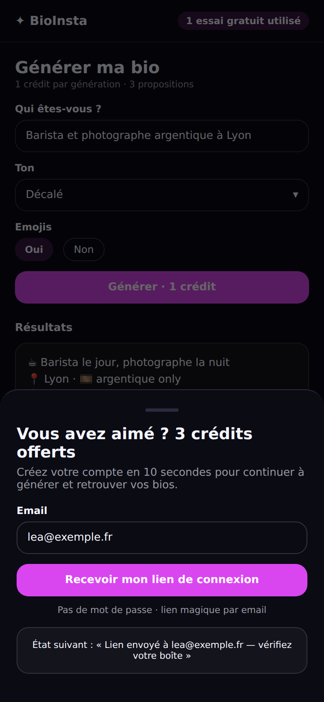

### SA-04 · Paywall

Le bouton Acheter ouvre la modale de paiement simulée (SA-05), sans quitter l'outil.

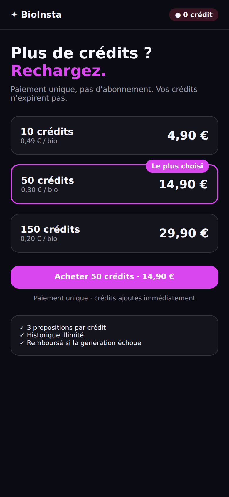

### SA-05 · Paiement simulé (modale plein écran sur mobile)

D'abord le formulaire, avec carte de test préremplie et l'état « paiement en cours » ; ensuite la confirmation avec le nouveau solde. La modale se ferme et l'utilisateur reprend sa génération.

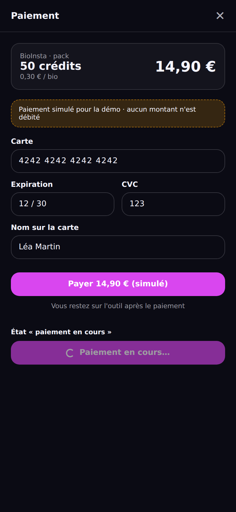

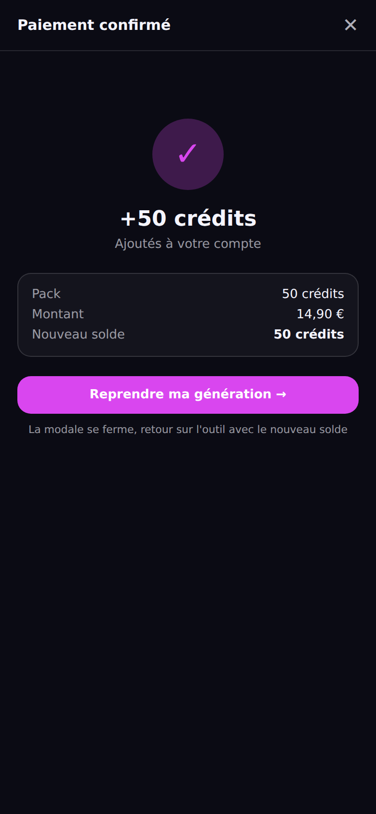

### SA-06 · Historique (DescriPro, thème Corporate)

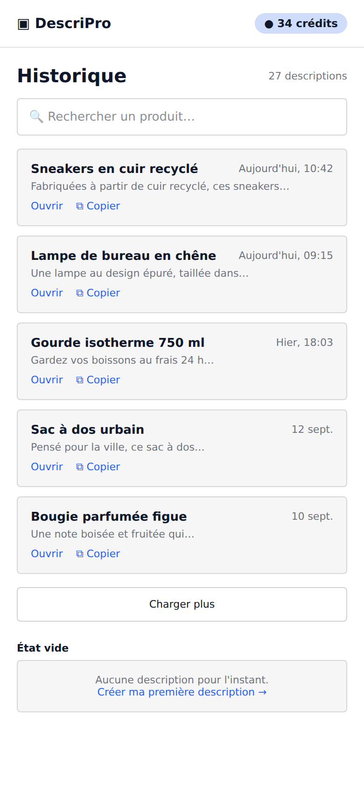

### SA-07 · Compte & crédits (NomDeMarque, thème Playful)

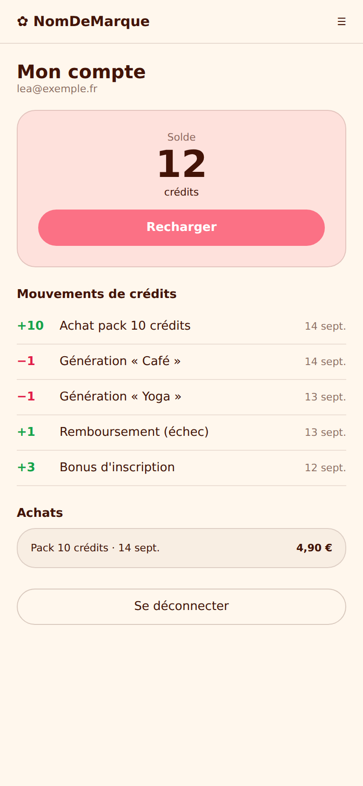

### SA-08 · Produit introuvable

Affiché pour un slug inconnu ou un produit passé en Killed ; renvoie vers les autres produits du studio.

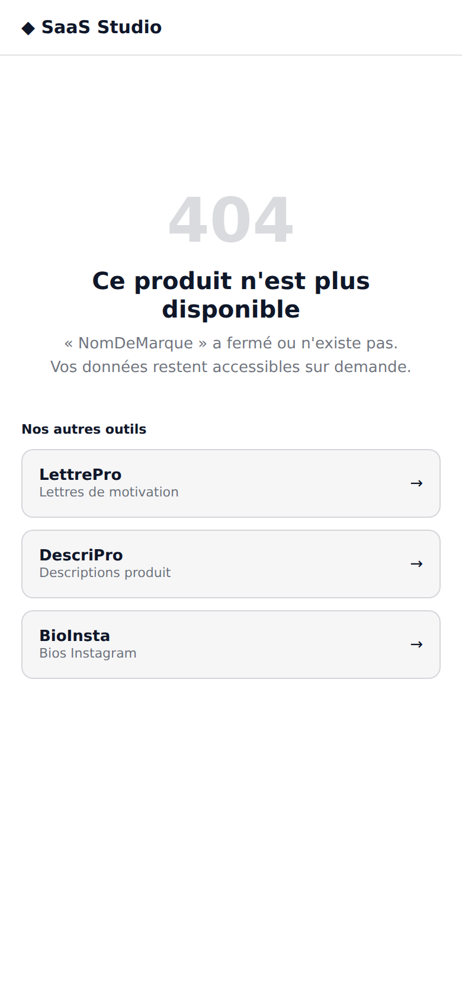
