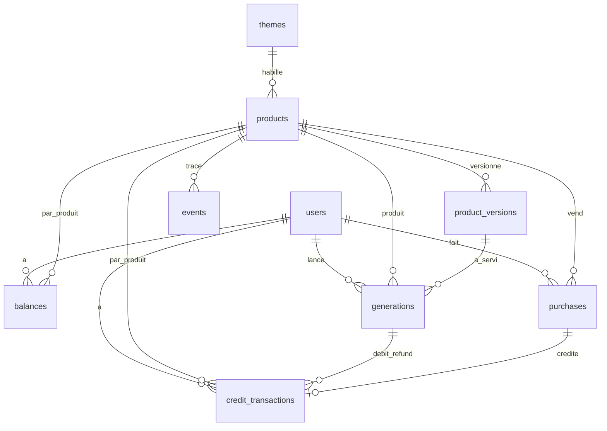

# Modèle de données

## Vue d'ensemble

**10 tables métier en Postgres, gérées par Drizzle**, plus les tables de Better Auth (sessions, comptes, vérifications) qu'on ne touche pas. Deux blocs : le **catalogue** (produits, thèmes, versions de config, seuils de décision), modifié depuis le backoffice et mis en cache ; et l'**usage** (crédits, générations, achats, events), écrit à chaque action et jamais mis en cache.



Les crédits sont **par utilisateur et par produit** : chaque SaaS est indépendant pour l'utilisateur, comme dans un vrai portefeuille. Les générations et events anonymes n'ont pas de `user_id` mais un `anonymous_id` (cookie).

## Catalogue

### `users`

La table utilisateur de Better Auth, étendue d'un rôle.

| Colonne | Type | Contraintes | Rôle |
| --- | --- | --- | --- |
| `id` | text | PK | Géré par Better Auth |
| `email` | text | unique, non nul | Identifiant de connexion (lien magique) |
| `role` | enum `user` \| `admin` \| `owner` | défaut `user` | `admin` : compte de démo du backoffice ; `owner` : mon compte, seul à accéder à `/admin/ops` |
| `created_at` | timestamptz | défaut `now()` |  |

### `themes`

| Colonne | Type | Contraintes | Rôle |
| --- | --- | --- | --- |
| `id` | uuid | PK |  |
| `slug` | text | unique | `editorial`, `neon`, `corporate`, `playful` |
| `name` | text | non nul | Nom affiché |
| `tokens` | jsonb | validé par Zod | Couleurs clair et sombre, clé de police du catalogue, radius |
| `landing_variant` | enum | non nul | Mise en page de la landing |
| `is_seed` | boolean | défaut `false` | Thème du seed, restauré à la remise à zéro |
| `updated_at` | timestamptz |  |  |

### `products`

La ligne « vivante » d'un produit : statut et pointeur vers sa config courante.

| Colonne | Type | Contraintes | Rôle |
| --- | --- | --- | --- |
| `id` | uuid | PK |  |
| `slug` | text | unique, format URL | Root param `[app]` |
| `status` | enum `test` \| `learn` \| `scale` \| `killed` | défaut `test` | Cycle de vie du produit |
| `theme_id` | uuid | FK → `themes` | Thème choisi |
| `current_version` | integer | non nul | Version de config en ligne |
| `locale` | text | `fr` \| `en` | Langue de la sub-app |
| `is_seed` | boolean | défaut `false` | Produit du seed, conservé et restauré à la remise à zéro |
| `created_by` | text | FK → `users` | Qui l'a créé (visiteur ou seed) |
| `status_note` | text |  | Note de décision du dernier changement de statut (BO-06) |
| `created_at`, `updated_at` | timestamptz |  |  |

### `product_versions`

Chaque sauvegarde du formulaire BO-05 crée une nouvelle version, jamais de modification en place. On sait ainsi quelle config a produit chaque génération.

| Colonne | Type | Contraintes | Rôle |
| --- | --- | --- | --- |
| `product_id` | uuid | FK → `products`, PK composite |  |
| `version` | integer | PK composite | 1, 2, 3… |
| `config` | jsonb | validé par le schéma Zod du produit | Branding, landing et SEO, champs de l'outil, génération (modèle, modèles de secours, prompt, type de sortie), pricing et packs |
| `created_by` | text | FK → `users` |  |
| `created_at` | timestamptz |  |  |

Les **packs de crédits** vivent dans `config.pricing.packs` : un achat recopie le pack (crédits, prix) au moment de l'achat, pour ne pas dépendre d'une config qui changera.

## Crédits et usage

### `credit_transactions` (le ledger)

Source de vérité des crédits : on n'y fait **que des insertions**, jamais de mise à jour ni de suppression (hors remise à zéro de la démo).

| Colonne | Type | Contraintes | Rôle |
| --- | --- | --- | --- |
| `id` | uuid | PK |  |
| `user_id` | text | FK → `users` |  |
| `product_id` | uuid | FK → `products` |  |
| `delta` | integer | non nul, ≠ 0 | `+3`, `+50`, `-1`, `+1`… |
| `reason` | enum `signup_bonus` \| `purchase` \| `generation` \| `refund` |  | Origine du mouvement |
| `generation_id` | uuid | FK → `generations`, nullable | Pour `generation` et `refund` |
| `purchase_id` | uuid | FK → `purchases`, nullable | Pour `purchase` |
| `idempotency_key` | text | unique | Un retry ne crée jamais deux mouvements |
| `created_at` | timestamptz |  |  |

### `balances`

Solde dénormalisé, pour lire le solde sans sommer le ledger. Mis à jour **dans la même transaction** que chaque insertion dans le ledger.

| Colonne | Type | Contraintes | Rôle |
| --- | --- | --- | --- |
| `user_id` | text | PK composite, FK → `users` |  |
| `product_id` | uuid | PK composite, FK → `products` |  |
| `balance` | integer | `CHECK (balance >= 0)` | Garantie en base qu'un solde ne passe jamais sous zéro |
| `updated_at` | timestamptz |  |  |

### `generations`

| Colonne | Type | Contraintes | Rôle |
| --- | --- | --- | --- |
| `id` | uuid | PK |  |
| `product_id` | uuid | FK → `products` |  |
| `product_version` | integer | FK composite → `product_versions` | Config qui a produit la sortie |
| `user_id` | text | FK → `users`, nullable | Nul pour la génération anonyme gratuite |
| `anonymous_id` | text | nullable | Cookie du visiteur anonyme |
| `ip_hash` | text |  | IP hachée, pour la limite anonyme et le rate limit |
| `input` | jsonb |  | Valeurs saisies dans les champs de l'outil |
| `output` | jsonb |  | Texte ou objet structuré ; URL pour une image |
| `model` | text |  | Modèle qui a réellement répondu (fallback éventuel) |
| `input_tokens`, `output_tokens`, `cached_input_tokens` | integer |  | Issus de `usage` |
| `cost_micros` | integer |  | Coût IA en millionièmes de dollar (évite les arrondis) |
| `status` | enum `pending` \| `succeeded` \| `failed` |  | `failed` déclenche le remboursement |
| `idempotency_key` | text | unique | Clé envoyée par le client |
| `created_at` | timestamptz |  |  |

### `purchases`

| Colonne | Type | Contraintes | Rôle |
| --- | --- | --- | --- |
| `id` | uuid | PK |  |
| `user_id` | text | FK → `users` |  |
| `product_id` | uuid | FK → `products` |  |
| `pack_id` | text |  | Identifiant du pack dans la config |
| `credits` | integer | > 0 | Recopié du pack au moment de l'achat |
| `amount_cents` | integer | > 0 | Recopié du pack |
| `currency` | text | défaut `EUR` |  |
| `idempotency_key` | text | unique | Protège du double clic |
| `created_at` | timestamptz |  |  |

### `events`

Table d'analytics à insertion seule, source du funnel et des dashboards. `track()` dédoublonne trois types, pour qu'un rejeu ne gonfle pas le funnel : `visit` une fois par `anonymous_id`, produit et jour UTC ; `signup` une fois par produit et `user_id` ; `purchase` une fois par `metadata.purchaseKey` (la clé d'idempotence de l'achat).

| Colonne | Type | Contraintes | Rôle |
| --- | --- | --- | --- |
| `id` | bigint | PK, identity |  |
| `product_id` | uuid | FK → `products` |  |
| `type` | enum `visit` \| `first_generation` \| `signup` \| `generation` \| `credits_exhausted` \| `purchase` |  | Étapes du funnel et actions |
| `user_id` | text | nullable |  |
| `anonymous_id` | text | nullable | Relie la visite anonyme à l'inscription |
| `metadata` | jsonb |  | Pack acheté, référent, variante d'A/B test plus tard |
| `created_at` | timestamptz |  |  |

## Pilotage

### decision\_thresholds

Les seuils qui déclenchent les badges « à couper » et « à scaler », réglables depuis le backoffice (BO-09) sans déploiement. Une ligne sans `product_id` porte les valeurs par défaut du studio ; une ligne par produit peut les surcharger, champ par champ (colonne nulle = valeur par défaut).

| Colonne | Type | Contraintes | Rôle |
| --- | --- | --- | --- |
| id | uuid | PK |  |
| product\_id | uuid | FK → products, nullable, unique (NULLS NOT DISTINCT) | Nul = réglage par défaut du studio |
| min\_visits | integer | > 0 | Volume minimal avant toute suggestion (1 000) |
| kill\_max\_conversion | numeric(5,4) | entre 0 et 1 | Conversion inscription → achat sous laquelle on suggère de couper (0,02) |
| scale\_min\_conversion | numeric(5,4) | entre 0 et 1 | Conversion à partir de laquelle on suggère de scaler (0,05) |
| scale\_requires\_positive\_margin | boolean |  | Scaler seulement si la marge par génération est positive (vrai) |
| is\_seed | boolean | défaut false | Réglage par défaut du seed, restauré à la remise à zéro |
| updated\_by | text | FK → users | Qui a changé les seuils |
| updated\_at | timestamptz |  |  |

La décision elle-même reste une fonction pure, `lib/decision.ts` : `evaluate(metrics, thresholds)` renvoie `kill`, `scale` ou `null`. Elle se teste sans base, et le DAL ne fait que fournir les seuils fusionnés (défaut + surcharge du produit), mis en cache avec le tag `thresholds`.

## Invariants, index et migrations

**Invariants garantis par la base**, pas seulement par le code : les tests Vitest du DAL les vérifient un par un.

| Invariant | Mécanisme |
| --- | --- |
| Un solde ne passe jamais sous zéro | `CHECK (balance >= 0)` sur `balances` + débit en `UPDATE … WHERE balance >= cost` |
| Le solde égale la somme du ledger | Ledger et solde écrits dans la même transaction ; un test compare les deux après chaque scénario |
| Un double clic ou un retry ne débite ni ne crédite deux fois | `idempotency_key` unique sur `credit_transactions`, `generations`, `purchases` |
| Une génération échouée est remboursée une seule fois | Clé d'idempotence du remboursement dérivée de `generation_id` |
| Une génération pointe vers une config qui existe | FK composite `(product_id, product_version)` |
| Un achat ne dépend pas d'une config modifiée ensuite | Crédits et prix recopiés dans `purchases` |
| Le seuil « à couper » reste sous le seuil « à scaler », et il n'existe qu'un réglage par défaut | CHECK (kill\_max\_conversion < scale\_min\_conversion) ; unique (product\_id) NULLS NOT DISTINCT sur decision\_thresholds |

**Index**

| Table | Index | Sert à |
| --- | --- | --- |
| `generations` | `(user_id, created_at)` et `(ip_hash, created_at)` | Rate limit et limite anonyme (comptage sur 60 secondes) |
| `generations` | `(product_id, created_at)` | Historique et fiche activité |
| `events` | `(product_id, type, created_at)` | Funnel et courbes sur 30 jours |
| `credit_transactions` | `(user_id, product_id, created_at)` | Mouvements de crédits (SA-07, BO-04) |
| `products` | `slug` (unique) | Résolution du root param `[app]` |

**Extrait Drizzle du débit**

```ts
// lib/dal/credits.ts
class InsufficientBalance extends Error {}

export type DebitResult =
  | { ok: true; balance: number }
  | { ok: true; replay: true }
  | { ok: false; reason: 'insufficient_balance' }

export async function debit({ userId, productId, cost, generationId, key }: Debit): Promise<DebitResult> {
  try {
    return await db.transaction(async (tx) => {
      // 1. Le mouvement d'abord : si la clé existe déjà (retry), rien n'est inséré
      const inserted = await tx.insert(creditTransactions)
        .values({ userId, productId, delta: -cost, reason: 'generation', generationId, idempotencyKey: key })
        .onConflictDoNothing({ target: creditTransactions.idempotencyKey })
        .returning({ id: creditTransactions.id })
      if (inserted.length === 0) return { ok: true as const, replay: true as const }

      // 2. Puis le solde, seulement s'il suffit. Pas de ligne balances = solde 0 = refus.
      const [row] = await tx.update(balances)
        .set({ balance: sql`${balances.balance} - ${cost}`, updatedAt: new Date() })
        .where(and(eq(balances.userId, userId), eq(balances.productId, productId), gte(balances.balance, cost)))
        .returning({ balance: balances.balance })
      if (!row) throw new InsufficientBalance()     // annule toute la transaction, mouvement compris
      return { ok: true as const, balance: row.balance }
    })
  } catch (e) {
    if (e instanceof InsufficientBalance) return { ok: false, reason: 'insufficient_balance' }
    throw e                                          // vraie erreur de base : remonte telle quelle
  }
}

// Crédits entrants (bonus, achat, remboursement) : crée la ligne balances si elle manque
async function credit(tx: Tx, { userId, productId, delta }: Credit) {
  await tx.insert(balances)
    .values({ userId, productId, balance: delta })
    .onConflictDoUpdate({
      target: [balances.userId, balances.productId],
      set: { balance: sql`${balances.balance} + ${delta}`, updatedAt: new Date() },
    })
}

// Lecture : pas de ligne = 0
export async function getBalance(userId: string, productId: string) {
  const row = await db.query.balances.findFirst({ where: and(eq(balances.userId, userId), eq(balances.productId, productId)) })
  return row?.balance ?? 0
}
```

L'ordre compte : on insère le mouvement **avant** de toucher au solde. Un retry avec la même clé ne produit aucune insertion et sort sans débiter. Un solde insuffisant annule toute la transaction, mouvement compris.

**Deux règles de contrat :**

- **Le refus est une valeur, pas une exception.** `debit()` renvoie `{ ok: false, reason: 'insufficient_balance' }` ; l'appelant n'a qu'un `if` à écrire pour répondre 402 et ouvrir le paywall. Seule une vraie erreur de base remonte en exception. On lève une erreur maison plutôt que `tx.rollback()`, pour que le `catch` ne confonde pas les deux cas.
- **Pas de ligne `balances` = solde 0.** Un utilisateur jamais crédité sur ce produit n'a pas de ligne : le débit est refusé (comportement voulu) et `getBalance()` renvoie 0. Tout ce qui ajoute des crédits (`grantSignupBonus`, `purchase`, `refund`) passe par `credit()`, qui crée la ligne si elle manque (upsert).

Chaque branche (débit normal, retry, solde insuffisant, pas de ligne, deux débits concurrents, premier crédit) a son test.

**Migrations et seed**

- Schéma dans `lib/db/schema.ts`, migrations générées par `drizzle-kit generate` et committées, appliquées par `drizzle-kit migrate` avant le déploiement.
- En développement, une base Postgres locale par worktree (onglet Implémentation) ; les tests e2e tournent sur une base seedée à chaque exécution.
- `db:seed` crée les thèmes et produits `is_seed`, le compte admin de démo et le compte `owner`, les historiques depuis les fixtures, et 30 jours d'events calculés. Avec `DEMO_MODE=true`, il refuse de tourner avec les identifiants de développement (`SEED_ADMIN_*` et `SEED_OWNER_*`, documentés dans `.env.example`).
- La remise à zéro (`scripts/reset-demo.ts`) supprime les produits visiteurs (non `is_seed`) et tout l'usage (générations, achats, ledger, soldes, events, comptes utilisateurs finaux), restaure le catalogue seedé, puis rejoue l'usage du seed. `is_seed` ne sert qu'à ça : il ne verrouille rien.

**Hors v1** : table d'expériences A/B, table d'agrégats quotidiens (les dashboards calculent directement sur `events`, largement suffisant à ce volume).

**Suivis de contrat relevés pendant le run v1** (une PR de contrat chacun, quand le volume le justifiera) : index sur `purchases` (`(product_id, created_at)` et `(user_id, product_id, created_at)`) et sur `credit_transactions (product_id, created_at)` pour le portefeuille, le funnel et les listes d'activité ; pour le dédoublonnage de `track()`, un index `events (product_id, type, user_id)` et une colonne ou un index d'expression sur `metadata->>purchaseKey`.
