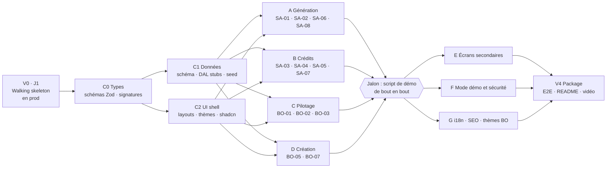

# Implémentation

La façon de construire est une démo en soi. Dotworld écrit « We develop with AI, not alongside it » : le repo doit montrer comment on fait avancer **plusieurs agents en parallèle** sans perdre la maîtrise.

Trois règles structurent tout l'onglet :

1. **Déployer dès le jour 1**. Une URL de prod existe avant la première fonctionnalité. Avant chaque run, l'orchestrateur crée depuis `main` une branche d'intégration à son nom (par exemple `integration/v1-contracts`, via `worktree.ts integration`) ; les PR des specs y arrivent, et sa preview Vercel montre l'état du run. Chaque jalon validé est mergé dans `main`, qui part en production.
2. **Les contrats avant le parallèle**. Schéma, types, signatures du DAL, thèmes et layouts sont posés une fois, en série. Ensuite, chaque agent travaille dans son périmètre sans marcher sur les autres.
3. **Spec puis tests, puis code**. Aucun agent ne code sans une spec validée par moi. Aucune implémentation ne commence sans tests rouges committés. Aucun merge sans ma relecture.

## La boucle d'une tâche

| # | Étape | Qui | Sortie |
| --- | --- | --- | --- |
| 1 | Écrire la spec minimale de la feature | Moi, avec Claude | `specs/<REF>-<nom>.md`, une dizaine de lignes |
| 2 | **Porte 1 : valider les specs** | Moi | Specs mergées sur `main`, avant le run |
| 3 | Plan : tâches, fichiers, risques (`/plan`) | Agent `planner` | `.claude/plans/<REF>.plan.md` commité |
| 4 | Boucle TDD : un comportement à la fois, test rouge puis code vert, commit et push à chaque étape verte, sans pause jusqu'à la fin de la spec (`/tdd`) | Agent `tdd-guide` | Trace rouge → vert dans les commits, 80 % de couverture sur `lib/**` |
| 5 | Revue de code (`/review`), corrections jusqu'à zéro CRITICAL ou HIGH | `code-reviewer` + spécialistes | Corrections commitées et poussées |
| 6 | `/verify` après merge de la branche d'intégration dans la branche | Agent | `pnpm check`, conformité à la spec, verdict **READY** |
| 7 | PR vers la branche d'intégration, puis squash merge dès que `/verify` est READY et la revue propre | Orchestrateur | **Un commit** par spec sur la branche d'intégration ; les specs débloquées démarrent |
| 8 | **Porte 2 : relire la branche d'intégration** une fois toutes les specs mergées | Moi | Corrections demandées, ou merge dans `main`, qui part en prod |

Deux règles tiennent la boucle honnête :

- **Un test commité est un contrat.** Si l'agent doit le modifier ensuite, il le fait dans un commit à part dont le message explique pourquoi (règle écrite dans `CLAUDE.md`). Je relis ces commits en premier : un agent qui adapte les tests au code, c'est le défaut classique.
- **Les agents n'attendent rien, et seul l'orchestrateur merge.** Les agents enchaînent les comportements sans s'arrêter ; l'orchestrateur merge chaque PR dans la branche d'intégration dès que `/verify` est READY et la revue propre, jamais dans `main`. La porte 2 est le seul chemin vers la prod.

**Un historique propre.** Sur la branche, l'agent committe à chaque étape verte. Aucun hook ne lance les tests au commit. Au merge, tout est écrasé en **un seul commit par feature** sur `main`, dont le message est le titre de la PR. La trace rouge → vert ne se perd pas : elle reste dans l'onglet *Commits* de chaque PR.

## Specs minimales et contrats gelés

La matière existe déjà dans ce dossier : écrans, routes, états, modèle de données, maquettes. Une spec ne la réécrit pas. Elle **pointe** dessus et n'ajoute que ce dont l'agent a besoin :

- des critères d'acceptation ;
- le contrat à respecter ;
- les fichiers qu'il peut toucher.

**Une spec = une feature = une PR = un commit sur `main`.**

```md
# SA-05 · Paiement simulé
Réf       : Écrans › SA-05 · Produit › Crédits · specs/mockups/SA-05.png
Contrat   : purchase(packId) → { balance }   lib/dal/credits.ts (gelé)
Acceptation :
- achat d'un pack → solde crédité, modale fermée, toast
- double clic ou rejeu → un seul crédit (clé d'idempotence)
- accès direct à /checkout/[packId] → version pleine page
Périmètre : [app]/@modal/(.)checkout/**, [app]/checkout/**, e2e/checkout.spec.ts
```

Les specs sont nommées d'après l'écran (`specs/SA-05-paiement.md`) ou la mécanique (`specs/ledger.md`). On réutilise les repères du dossier au lieu d'en inventer.

### Les contrats gelés en V1

C'est le cœur du parallèle : tout ce qu'un lot consomme chez un autre existe dès la fin de V1, au pire sous forme de **stub typé** qui renvoie une réponse plausible.

| Contrat | Où | En V1 | Remplacé par |
| --- | --- | --- | --- |
| Types et signatures de tous les contrats | `lib/schemas/*.ts` (Zod), signatures de `lib/dal/*`, `lib/security.ts` | Posés par CONTRACT-types, avant tout le reste | — |
| Schéma des tables | `lib/db/schema.ts` | Réel, complet | — |
| `getProduct(slug)`, `listProducts()` | `lib/dal/products.ts` | Réel, lit le seed | — |
| `getSession()`, `requireAdmin()` | `lib/dal/session.ts` | Réel depuis V0 | — |
| `createProduct()`, `updateStatus()` | `lib/dal/product-editor.ts`, `lib/dal/product-status.ts` | Insertion simple, sans contrôle métier | BO-05, BO-06 |
| `getBalance()`, `debit()`, `refund()`, `grantSignupBonus()`, `purchase()` | `lib/dal/credits.ts` | Solde fixe à 10, remboursement et bonus sans effet, `debit()` toujours ok | Ledger (lot B) |
| `recordGeneration()`, `markGenerationFailed()` | `lib/dal/generations.ts` | Insertion simple | SA-02 |
| `generate(product, input)` → stream | `lib/ai/generate.ts` | Mock : rejoue les fixtures | Lot A (bascule live) |
| `track(event)`, `<TrackVisit>` | `lib/dal/events.ts` | Ne fait rien | Lot C |
| `getFunnel()`, `getPortfolioMetrics()` | `lib/dal/metrics.ts` | Chiffres fixes plausibles | Lot C |
| `getThresholds(productId)` | `lib/dal/thresholds.ts` | Réel, lit le réglage seedé | — (l'écriture arrive avec BO-09) |
| `assertEditable(row)`, `isEditable(row)` | `lib/dal/guards.ts` | Ne bloquent rien | Retirés avec le fichier par CONTRACT-remove-demo-lock (#44) : décision humaine, pas de verrou démo |
| `guardRequest(kind)` | `lib/security.ts` | Laisse tout passer | SECURITY |

**Pourquoi ça fait shipper vite** :

- **Aucun lot n'attend un autre.** L'outil (lot A) appelle `debit()` dès J3, et la prod montre le parcours avec un faux solde. Quand le ledger (lot B) merge, il remplace le stub sans toucher une ligne du lot A.
- **Chaque feature mergée est en prod le jour même.** La prod ne casse jamais : elle devient plus vraie à chaque merge.
- **Un stub a ses tests de contrat** (types et forme de la réponse). La vraie implémentation doit passer les mêmes. Changer un contrat passe par une PR de contrat (voir Orchestration).

## Roadmap technique en vagues

Les lots du planning (onglet Candidature) sont regroupés en **vagues** pour la lecture. Ce n'est pas une barrière : l'orchestrateur tient un **registre de dépendances** versionné sur la branche d'intégration et démarre une spec dès que **ses propres** dépendances sont mergées et qu'un worktree est libre, sans attendre le reste de sa vague. Le registre est recalculé à chaque merge ; une dépendance découverte en cours de route devient une intégration en attente ou une spec résiduelle, jamais un oubli.



| Vague | Jours | Lots en parallèle | Contenu | Sortie |
| --- | --- | --- | --- | --- |
| **V0 Walking skeleton** | J1 | 1 agent | `create-next-app` 16.3, tout le Tooling dev, Neon et Vercel branchés. `/{slug}` lit un produit en base, `/admin` est protégé par Better Auth. | **URL de prod** et pnpm check vert |
| **V1 Contrats** | J2 | 1 agent, puis 2 | **C0 Types**, en premier : schémas Zod et signatures de tous les contrats. **C1 Données** : schéma Drizzle complet et migration, DAL en stubs typés (dont recordGeneration et guardRequest), modèle IA mock, seed d'un produit avec fixtures. **C2 UI shell** : les deux root layouts, 4 thèmes en variables CSS, composants shadcn, états communs (chargement, vide, erreur), messages i18n découpés par zone. | Les contrats sont gelés |
| **V2 Parcours** | J3–J6 | 4 lots, jusqu'à 10 specs | **A Génération** : landing, produit introuvable, outil, historique, `api/generate` streamé. **B Crédits** : vrai ledger, inscription, tarifs, paiement simulé, compte. **C Pilotage** : connexion, portefeuille, fiche produit, events et funnel. **D Création** : formulaire BO-05 en 7 étapes, bibliothèque de thèmes BO-07. | **Jalon** : le script de démo passe en prod |
| **V3 Compléments** | J7–J8 | 3 lots | **E** : BO-04, BO-06, BO-09. **F** : mode démo (`/admin/ops`, remise à zéro, bandeau « Démo », 3 produits seedés avec 30 jours d'usage et la config BioInsta), BotID, rate limit. **G** : vérification des clés anglaises, SEO et images OG, BO-08 si le temps le permet. | Démo complète |
| **V4 Package** | J9–J10 | Moi, en série | E2E du script de démo avec `instant()`, fixtures enregistrées en live, passe perf, README, vidéo | Envoi à Dotworld |

**Ce que ça change sur le planning** :

- La charge reste d'environ 14,5 jours de travail, mais la durée calendaire visée passe à **environ 10 jours ouvrés**.
- Le goulot n'est plus l'écriture du code : c'est **ma capacité à spécifier et à relire**. Les agents tournent jusqu'à 10 en parallèle ; ce sont les PR qui attendent ma relecture, d'où des PR courtes.
- C'est une hypothèse, et elle sera mesurée (section suivante). Les lots coupables restent ceux de l'onglet Candidature : BO-08, BO-04 et SA-07, BO-06, aperçu en direct.

**Préparer la vague suivante pendant la vague en cours** : les specs de V2 s'écrivent pendant que tournent V0 et V1, celles de V3 pendant V2. Les agents ne m'attendent jamais.

## Orchestration des agents

### Un lot = un worktree = une session

Chaque lot vit dans son propre worktree git, créé par `pnpm tsx scripts/worktree.ts new <slug>` (branche `feat/<slug>` poussée avec son upstream, `pnpm install`, base migrée et seedée), avec :

- sa propre session Claude Code ;
- sa propre base ;
- **pas de serveur de dev** : typecheck et Vitest n'en ont pas besoin, et Playwright lance le sien en fin de feature.

Au plus 10 worktrees actifs (`WORKTREE_MAX`). L'**orchestrateur** (la session principale, skill `orchestrator`) démarre une spec dès que ses dépendances sont mergées et qu'un worktree est libre, puis l'enchaîne de bout en bout : plan, TDD, revue, `/verify`, PR. Il libère le worktree après le merge : `worktree.ts rm <slug>` supprime la base, le worktree et la branche mergée ; le skill `worktrees` décrit tout le cycle. Pour voir l'interface : la preview Vercel de la PR, ou la branche lancée dans le checkout principal.

**Une base par worktree** : un seul Postgres local (cluster natif, ou le service Docker de `docker-compose.yml`) et une base par branche (`msb` pour `main`, `msb_feat_<slug>` pour un worktree), gérée par `scripts/worktree-db.ts`. Le hook de démarrage de session relance Postgres s'il est tombé. La preview Vercel, elle, pointe sur la base de preview partagée, en `AI_MODE=mock`.

**Des slots pour les commandes lourdes** : dix worktrees ne lancent pas dix `tsc` à la fois. `scripts/queued.sh` limite sur toute la machine les typecheck, les suites Vitest et les E2E (1), et ce sont les scripts `pnpm typecheck`, `pnpm test`, `pnpm test:coverage` et `pnpm test:e2e` qui prennent eux-mêmes leur slot (onglet Tooling dev). Un fichier de test seul tourne sans file. Les E2E tournent sur un port fixé par `E2E_PORT` (3100 par défaut) : un seul à la fois, donc jamais de conflit entre worktrees.

**Monitoring continu de la machine**, repris du Monitor de saturation de castflow, en trois couches :

1. **Un démon** (`scripts/monitor.ts start`) mesure le CPU et la mémoire toutes les 5 s, surveille le disque et Postgres, et ajuste seul, d'un cran au plus toutes les 30 s, les slots de typecheck et de tests (4 au départ) et le pool de worktrees (10 au départ) : à la hausse quand la machine est sous-utilisée sur 30 s et que la limite est le goulot (des jobs attendent, ou tous les worktrees sont occupés) ; à la baisse sous pression, le pool seulement sur pression mémoire. Il ne dépend pas de l'orchestrateur.
2. **Un flux d'événements** : le démon n'écrit que des événements (ajustement, saturation CPU, mémoire, disque ou connexions Postgres, Postgres tombé, chacun à son début et à sa fin). L'orchestrateur les suit avec l'outil `Monitor` et réagit dès qu'ils arrivent.
3. **Un heartbeat** `send_later` toutes les 5 min, seul mécanisme qui survit à un reset du conteneur : il relance le démon s'il est mort et réarme le `Monitor`.

De mon côté, `monitor.ts live` affiche l'usage en temps réel : machine, files, chaque job avec son worktree, sa durée et sa mémoire, derniers événements.

### Éviter les conflits plutôt que les résoudre

| Zone à risque | Règle |
| --- | --- |
| `lib/db/schema.ts` et les migrations | Gelés après V1. Un changement de schéma passe par une **PR de contrat** dédiée, courte, mergée en priorité. Les autres lots mergent la branche d'intégration dans leur branche. Un seul agent génère une migration à la fois. |
| `lib/schemas/`, signatures du DAL | Même règle : ce sont des contrats. |
| `messages/*.json` | Découpés par zone (`messages/fr/tool.json`, `credits.json`, `bo.json`…) et fusionnés dans `i18n/request.ts`. Chaque lot n'écrit que son fichier, en français et en anglais. |
| `components/ui/` | Installé en V1. Un lot qui a besoin d'un nouveau composant shadcn l'ajoute dans sa PR ; si deux lots le font, le conflit est trivial. |
| Tout le reste | Périmètre d'écriture de la spec. Les Server Actions vivent dans \<domaine>/\_actions.ts, à côté de \<domaine>/\_components/ : jamais de fichier d'actions partagé. |

### Rôles

- **Moi** : architecte et relecteur. J'écris et valide les specs (porte 1). L'orchestrateur merge chaque PR de spec dans la branche d'intégration dès qu'elle passe `/verify` et la revue automatique, et reprend lui-même une spec bloquée. Une fois toutes les specs mergées, je relis la branche d'intégration (porte 2) puis je la merge dans `main`, qui part en prod.
- **Orchestrateur et agents** : l'orchestrateur répartit les specs sur les worktrees et suit leur état ; dans chaque worktree, `planner` écrit le plan, `tdd-guide` écrit les tests et implémente, les relecteurs passent le diff, puis l'orchestrateur ouvre la PR.
- **Ordre de merge dans une vague** : le lot qui porte un contrat réel passe en premier (B, qui remplace le stub `debit()`), puis les autres mergent la branche d'intégration dans leur branche (jamais de rebase d'une branche poussée). PR courtes : un lot peut en ouvrir plusieurs, une par écran.

## Rendre la méthode visible

Le lead technique de Dotworld jugera la méthode sur ce qu'il voit dans le repo, pas sur ce que j'en dis.

- **`specs/`** dans le repo : une spec minimale par feature, validée avant le code, qui renvoie vers ce dossier.
- **Un `main` lisible** : un commit conventionnel par feature, donc l'historique se lit comme la roadmap. Chaque PR renvoie à sa spec et garde sa trace TDD : un commit par comportement passé au vert.
- **Les déploiements Vercel** : la prod existe depuis le jour 1, et on la voit grandir vague par vague.
- **Un tableau de bord de la méthode**, en fin de README, généré par un script `gh` plutôt que rempli à la main :
  - nombre de PR et délai spec → merge ;
  - part des commits produits par agent ;
  - nombre de corrections demandées en relecture, et 2 ou 3 exemples concrets de ce que la relecture a attrapé ;
  - durée réelle comparée à l'estimation, vague par vague.

Ces chiffres alimentent directement la question d'entretien « quelle part du code a été écrite par des agents ? » (onglet Candidature).

## Risques et parades

| Risque | Parade |
| --- | --- |
| L'agent modifie les tests pour les faire passer | Tests rouges committés en premier ; toute modification signalée dans la PR ; je relis ce diff d'abord |
| Des écrans incohérents entre agents | UI shell et états communs posés en V1 ; maquettes jointes à chaque spec |
| Un contrat bouge en pleine vague | Stubs typés dès V1 ; changement par PR de contrat, mergée en priorité |
| Je deviens le goulot de relecture | PR courtes, une par écran ; revue automatique avant la mienne ; specs de la vague suivante écrites en avance |
| Conflits de fusion | Périmètres d'écriture disjoints ; messages i18n découpés ; schéma gelé |
| L'agent invente des API Next.js 16.3 | Doc versionnée via `AGENTS.md`, `next-devtools-mcp`, `pnpm check` bloquant |
| La prod casse après un merge | /verify READY obligatoire ; rollback instantané depuis Vercel ; le jalon est vérifié sur la prod à chaque fin de vague |
